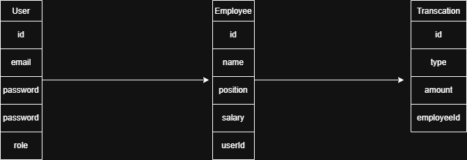

## 1. System Architecture

The system follows a client-server architecture:

Frontend: Next.js (React-based UI)
Backend: NestJS (Node.js API)
Database: PostgreSQL
Cache: Redis

Flow:
User → Frontend → Backend → Database

The architecture is modular and scalable, allowing future transition to microservices.

The system is also designed to support multi-tenant architecture (future scope).

Additionally, the system uses Role-Based Access Control (RBAC) to restrict access based on user roles such as Admin, HR, Finance, and Manager.

## 2. Diagrams

The system design is represented using the model:

* Context Diagram: Shows interaction between users and the ERP system.
* Container Diagram: Shows major components (Frontend, Backend, Database, Cache).
* Component Diagram: Shows internal backend modules.

(Diagrams are attached in the docs folder)

 

## 3. Modules

The backend is divided into the following modules:

* Auth Module – Handles login/signup and authentication
* Employee Module – Manages employee data (CRUD operations)
* Finance Module – Handles income and expense transactions
* Dashboard Module – Provides data visualization and analytics

## 4. Database Design

The system uses a relational database (PostgreSQL).

User Table
* id
* email
* password
* role (Admin, HR, Finance, Manager)

Employee Table
* id
* name
* position
* salary

Transaction Table
* id
* type (income/expense)
* amount

## 5. API Design

All APIs follow REST principles and will be secured using JWT authentication.

### Auth
* POST /login  
* POST /signup  

### Employee
* GET /employees  
* POST /employees  
* PUT /employees/:id  
* DELETE /employees/:id  

### Finance
* GET /transactions  
* POST /transactions  

## 6. Project Structure
The project follows a simple monorepo structure:

amx-erp/
├── docs/
├── api/
├── web/

## 7. Design Approach

* Focus on MVP (Minimum Viable Product) implementation
* Modular architecture for easy scalability
* Clean separation of frontend and backend
* Designed for future enhancements (AI, microservices, advanced modules) 

